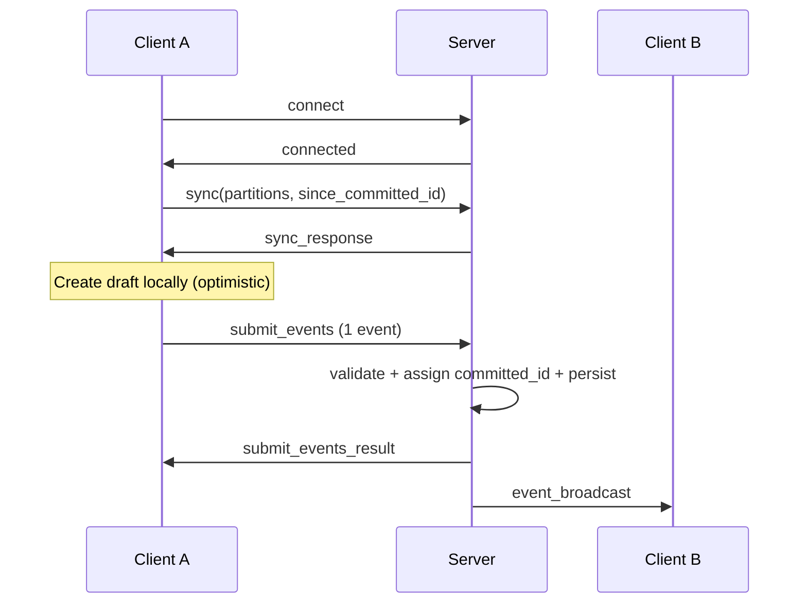

# Insieme Docs

Start here. This is the docs entrypoint and navigation index.

Insieme is an offline-first collaborative library with an authoritative server. Clients create local drafts, submit them, and converge on server-ordered committed events.

## Core Model

- Server assigns global monotonic `committed_id`.
- Client-generated `id` is the dedupe key.
- Origin submit outcome comes from `submit_events_result`.
- Catch-up uses `sync` with `since_committed_id`.

## Architecture

## Protocol Spec

- `protocol/messages.md` - envelope and message schemas.
- `protocol/connection.md` - handshake/auth/reconnect semantics.
- `protocol/ordering-and-idempotency.md` - ordering and dedupe invariants.
- `protocol/partitions.md` - partition shape, authorization, and delivery scope.
- `protocol/validation.md` - required validation boundaries.
- `protocol/durability.md` - commit flow, sync paging, persistence guarantees.
- `protocol/errors.md` - canonical error set and recovery guidance.

## Client Runtime

- `client/storage.md` - local storage model (`local_drafts` + `committed_events`).
- `client/drafts.md` - draft lifecycle and idempotent apply rules.
- `client/tree-actions.md` - tree action semantics (app-level extension).
- `../examples/real-client-usage/` - production-style client integration examples.

## Interface Reference

- `reference/javascript-interface.md` - minimal JS client/server factory interface.

## Sync Scenarios

`sync-scenarios/` contains core behavior scenarios aligned with the simplified protocol surface.

## Future Drafts

- `drafts/collaborative-text.md`
- `drafts/split-drafts-and-committed-storage.md`
- `drafts/minimal-protocol-core.md`

## Glossary

| Term | Definition |
|------|-----------|
| `client_id` | Authenticated client/device identifier. |
| `id` | Global event UUID generated by client. Used for dedupe and draft matching. |
| `committed_id` | Server-assigned global monotonic commit order. |
| `draft_clock` | Local monotonic ordering key for drafts only. |
| `partitions` | Logical stream keys attached to events. |
| `rebase` | Recompute local state from committed events then apply drafts. |

## Source of Truth Rules

- Normative behavior: `protocol/*.md` and `client/*.md`.
- `roadmap.md` and `drafts/*.md` are planning/design materials.
