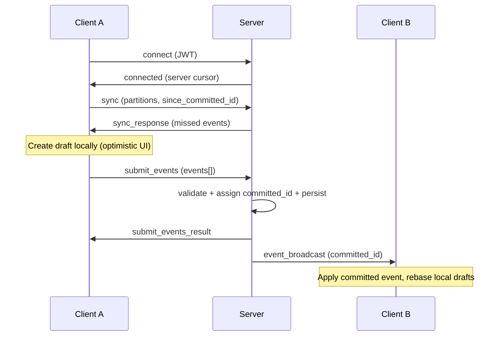

# Insieme Docs

Start here. This is the single docs entrypoint and navigation index.

Insieme is an offline-first collaborative library built on an authoritative server model. Clients create events locally (optimistic UI), send them to the server for validation, and receive committed events back in a globally ordered stream. Conflict resolution uses Last-Write-Wins (LWW) with server commit order as the canonical timeline.

For single-client/local-only use, the client runtime can run fully offline without any server. A server is required only for multi-client collaboration and authoritative commit/validation.

For design philosophy, goals, and trade-offs, see [motivation.md](motivation.md).

## Interface Profiles

To keep one source of truth and minimize long-term risk:

- Low-level core: model/event-sourcing runtime.
- App-facing profiles are both first-class:
  - Tree profile (`set`, `unset`, `tree*`) for free-form dynamic data.
  - Event profile (`type: event`) for strict schema-driven commands.

## Architecture

## First Read

1. `motivation.md` - design goals, tradeoffs, and interface rationale.
2. `javascript-interface.md` - small JS interface contract for client and backend.
3. `roadmap.md` - implementation plan (backend + frontend + test strategy).

## Protocol Spec

- `protocol/messages.md` - wire envelope and all message schemas.
- `protocol/connection.md` - handshake, auth, lifecycle, profile negotiation.
- `protocol/ordering-and-idempotency.md` - global ordering and dedupe semantics.
- `protocol/partitions.md` - partition rules, subscriptions, multi-partition behavior.
- `protocol/validation.md` - event/tree profile validation and policy gates.
- `protocol/durability.md` - commit flow, sync paging, persistence guarantees.
- `protocol/errors.md` - canonical error codes and recovery behavior.

## Client Runtime

- `client/storage.md` - local tables, snapshots, cursor mapping, retention.
- `client/drafts.md` - draft lifecycle, rebase, idempotent apply strategy.
- `client/tree-actions.md` - tree profile action semantics and edge cases.

## Scenarios

- `sync-scenarios/00-handshake-empty-sync.md`
- `sync-scenarios/01-local-draft-commit-broadcast.md`
- `sync-scenarios/02-local-draft-rejected.md`
- `sync-scenarios/03-duplicate-submit-retry.md`
- `sync-scenarios/04-multi-partition-event.md`
- `sync-scenarios/05-reconnect-catch-up-paged.md`
- `sync-scenarios/06-out-of-order-commit-arrival.md`
- `sync-scenarios/07-snapshot-prune.md`
- `sync-scenarios/08-model-local-validation.md`
- `sync-scenarios/09-same-id-different-payload.md`
- `sync-scenarios/10-broadcast-vs-origin-commit.md`
- `sync-scenarios/11-concurrent-drafts-commit-reordered.md`
- `sync-scenarios/12-partition-added-mid-session.md`
- `sync-scenarios/13-retry-while-draft-pending.md`
- `sync-scenarios/14-lww-conflict-concurrent-update.md`
- `sync-scenarios/15-server-crash-recovery.md`
- `sync-scenarios/16-batch-submit-offline-catchup.md`
- `sync-scenarios/17-heartbeat-and-disconnect.md`
- `sync-scenarios/18-error-and-version-change.md`

## Future Work

- `drafts/collaborative-text.md` - design draft for native OT-based text editing (not implemented).

## Glossary

| Term | Definition |
|------|-----------|
| `client_id` | Authenticated client/device identifier. Represents event origin client and is distinct from event ids and tree item ids. |
| `id` | Event id (globally unique UUID assigned by the client when creating an event). Used for dedup and draft-to-commit matching; not a tree item id. |
| `committed_id` | Server-assigned global monotonic integer. Defines canonical ordering of all committed events. Never reused, survives restarts. |
| `draft_clock` | Local monotonic counter on each client for ordering drafts. Not transmitted to the server; no cross-client meaning. |
| `partitions` | Array of strings identifying logical streams an event belongs to. An event can belong to multiple partitions. |
| `rebase` | Recomputing local view state by replaying committed events in order, then applying drafts on top. Triggered when new committed events arrive. |
| `snapshot` | Serialized committed-only state for a partition. Used for fast initialization without replaying the full event log. |
| `model_version` | Integer version of the model/domain schema (event profile / `canonical`). When it changes, clients must invalidate snapshots and re-sync. |
| `sync cycle` | A sequence of paginated `sync` / `sync_response` exchanges until `has_more=false`. Broadcasts received during a cycle are buffered if they exceed the cycle high-watermark. |
| `LWW` | Last-Write-Wins. Conflict resolution where the event with higher `committed_id` wins. Server commit order is deterministic and final. |

## Source of Truth Rules

- Normative behavior lives in `protocol/*.md` and `client/*.md`.
- `roadmap.md` is execution planning only (not normative protocol text).
- Keep terminology consistent:
  - tree profile = `compatibility` wire profile
  - event profile = `canonical` wire profile
