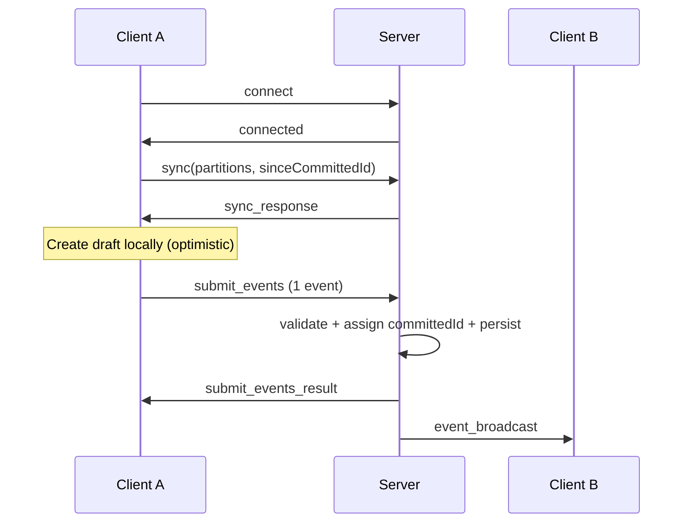

# Insieme Docs

Start here. This is the docs entrypoint and navigation index.

Insieme is an offline-first collaborative library with an authoritative server. Clients create local drafts, submit them, and converge on server-ordered committed events.

## Core Model

- Server assigns global monotonic `committedId`.
- Client-generated `id` is the dedupe key.
- Origin submit outcome comes from `submit_events_result`.
- Catch-up uses `sync` with `sinceCommittedId`.
- Committed event records use `{ id, partitions, projectId?, userId?, type, payload, meta, committedId, created }`.

## Architecture

```mermaid
sequenceDiagram
    participant C1 as Client A
    participant S as Server
    participant C2 as Client B

    C1->>S: connect
    S->>C1: connected
    C1->>S: sync(partitions, sinceCommittedId)
    S->>C1: sync_response

    Note over C1: Create draft locally (optimistic)
    C1->>S: submit_events (1 event)
    S->>S: validate + assign committedId + persist
    S->>C1: submit_events_result
    S->>C2: event_broadcast
```

## Product Scope

- `product-scope.md` - scope boundary: opinionated library (not framework), with pluggable edges.

## Protocol Spec

- `protocol/messages.md` - envelope and message schemas.
- `protocol/connection.md` - handshake/auth/reconnect semantics.
- `protocol/ordering-and-idempotency.md` - ordering and dedupe invariants.
- `protocol/partitions.md` - partition shape, authorization, and delivery scope.
- `protocol/validation.md` - required validation boundaries.
- `protocol/durability.md` - commit flow, sync paging, persistence guarantees.
- `protocol/errors.md` - canonical error set and recovery guidance.

## Client Runtime

- `client/storage.md` - local storage model (`local_drafts` + `committed_events`).
- `client/drafts.md` - draft lifecycle and idempotent apply rules.
- `client/materialized-views.md` - optional derived-state views (sizing + reducer reuse pattern).
- Built-in persistence adapters:
  - Client store: `createSqliteClientStore`, `createLibsqlClientStore`
  - Server sync store: `createSqliteSyncStore`, `createLibsqlSyncStore`
- `../examples/real-client-usage/` - production-style client integration examples.

## Interface Reference

- `reference/javascript-interface.md` - minimal JS client/server factory interface.

## Operations

- `production-checklist.md` - rollout and reliability hardening checklist.

## Sync Scenarios

`sync-scenarios/` contains core behavior scenarios aligned with the simplified protocol surface.

## Future Drafts

- `drafts/collaborative-text.md`
- `drafts/split-drafts-and-committed-storage.md`
- `drafts/minimal-protocol-core.md`
- `drafts/first-class-schema-version.md`
- `drafts/persisted-projection-checkpoints.md` - proposal for checkpointed, partition-aware materialized views with exact reads

## Glossary

| Term | Definition |
|------|-----------|
| `clientId` | Authenticated client/device identifier. |
| `id` | Global event UUID generated by client. Used for dedupe and draft matching. |
| `committedId` | Server-assigned global monotonic commit order. |
| `draftClock` | Local monotonic ordering key for drafts only. |
| `partitions` | Logical stream keys attached to events. |
| `rebase` | Recompute local state from committed events then apply drafts. |

## Source of Truth Rules

- Normative behavior: `protocol/*.md` and `client/*.md`.
- `roadmap.md` and `drafts/*.md` are planning/design materials.
- SQL/IndexedDB adapters store snake_case fields internally, but public JS and protocol docs use camelCase.
