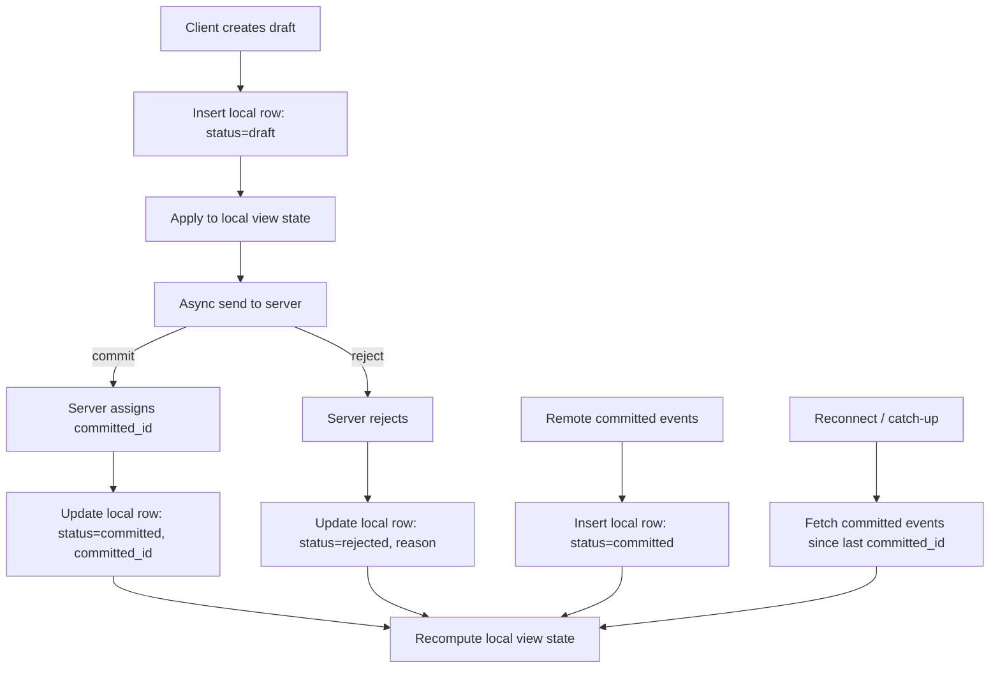

# Client Drafts vs Committed Events (Offline-First)

This document summarizes the agreed client behavior for drafts and committed
events, before any server implementation changes.

## Core Decisions

- **Single local table** for both drafts and committed events.
- **Drafts are saved locally first** (offline-first), then sent asynchronously.
- A draft can be **committed** or **rejected**.
- The client can receive **committed events from other clients**.
- Transport can be **WebSocket** or **polling** with the same semantics.

## Local Storage Model (Single Table)

Recommended columns:

- `id` (UUID, globally unique) — set for local drafts
- `committed_id` (integer, server-assigned incremental id) — set only when committed
- `status` (`draft` | `committed` | `rejected`)
- `partitions` (string[]) — event can belong to multiple partitions
- `type`, `payload` (event data)
- `client_id`, `created_at`, `status_updated_at` (metadata)
- `draft_clock` (integer, local Lamport-style counter for draft ordering)

Notes:
- `id` is globally unique and always present (also used for remote events).
- `client_id` refers to the **origin device** for the event (local or remote).
- `draft_clock` is a **global** Lamport-style counter on the local client.
- `draft_clock` is typically NULL for remote events.
- `created_at` is generated locally when the row is inserted.
- `status_updated_at` is server time supplied on commit/reject.
- `partitions` should be normalized as a **set** (dedupe + stable order).

### SQL Schema

```sql
CREATE TABLE events (
  id TEXT PRIMARY KEY,                 -- UUID (globally unique)
  committed_id INTEGER,                -- server incremental id (NULL until committed)
  type TEXT NOT NULL,
  payload TEXT NOT NULL,               -- JSON
  partitions TEXT NOT NULL,            -- JSON array of strings
  client_id TEXT NOT NULL,
  status TEXT NOT NULL CHECK(status IN ('draft','committed','rejected')),
  draft_clock INTEGER,                 -- local Lamport-style counter (drafts only)
  created_at INTEGER NOT NULL,         -- local DB insert time
  status_updated_at INTEGER,           -- server time when committed/rejected
  reject_reason TEXT                   -- optional
);

CREATE UNIQUE INDEX events_committed_unique
  ON events(committed_id)
  WHERE committed_id IS NOT NULL;

CREATE INDEX events_committed_order
  ON events(committed_id)
  WHERE status='committed';

CREATE INDEX events_draft_order
  ON events(draft_clock, id)
  WHERE status='draft';
```

### Snapshots Table

Snapshots store **committed-only** state per partition. Drafts are always
re-applied on top of snapshots.

Invalidation:
- If `model_version` changes (model/domain mode), discard the snapshot and
  rebuild from committed events to avoid applying drafts on stale state.
- For tree mode, if your app’s initial schema/state changes in a breaking way,
  clear snapshots or bump an app-level version and invalidate similarly.

```sql
CREATE TABLE snapshots (
  partition TEXT PRIMARY KEY,
  state TEXT NOT NULL,                 -- JSON
  committed_id INTEGER NOT NULL,       -- last committed_id included
  created_at INTEGER NOT NULL,
  model_version INTEGER                -- optional (model mode only)
);

CREATE INDEX snapshots_committed_id
  ON snapshots(partition, committed_id);
```

## Partitions

- `partitions` is always an **array of strings**.
- An event can belong to **multiple partitions**.
- Per-partition state uses **events whose partitions include that partition**.
- `committed_id` is **global and monotonic**; per-partition ordering is the
  subsequence of committed events that include the partition.

Practical rules:
- `committed_id` is unique **globally**.
- The server guarantees `committed_id` is **monotonic**.
- `id` (draft UUID) is used to match a local draft with its commit.
- A client may participate in multiple partitions at once.
- If a client **adds** a new partition to its subscription, it must sync from
  `since_committed_id=0` (or track per-partition cursors).

## Event Lifecycle

1) **Create Draft (local)**
   - If running **model/domain mode**, validate the event locally before insert.
   - Insert row with `status='draft'`, `committed_id=NULL`, `partitions=[...]`
   - Apply to UI immediately (optimistic)
   - Enqueue async send to server

2) **Committed by Server**
   - Update same row: `status='committed'`, set `committed_id`, `status_updated_at`
     (server-provided time)
   - Draft is removed from overlay automatically (by status)

3) **Rejected by Server**
   - Update row: `status='rejected'`, set `status_updated_at`
     (server-provided time, optionally store reason)
   - Draft no longer appears in UI (excluded by status)

4) **Remote Committed Event (other clients)**
   - Insert row as `status='committed'`, set `committed_id`, `partitions=[...]`
   - `id` is included and matches the origin client's draft id

## Local View Computation

The UI state should be computed from:

1. **Committed events** (all rows with `status='committed'`
   that include the partition)
   - Ordered by `committed_id` (global incremental id)
2. **Draft events** (all rows with `status='draft'`
   that include the partition)
   - Ordered by `draft_clock` (tie-break with `id` if needed)

Rejected drafts are **excluded** from view computation.

### Naming

- **Committed state**: state built only from committed events.
- **Local view state** (effective state): committed state + draft overlay.

### Ordering Strategy

- **Do not interleave** drafts into the committed stream.
- Always compute: `committed_state` → then apply all drafts on top.
- When a new committed event arrives (local commit or remote broadcast),
  **recompute committed state** and re-apply drafts (rebase).
- This may cause brief UI reordering during poor connectivity, but LWW + rebase
  keeps the client simple and convergent.

### Draft Clock (Lamport-style)

- `draft_clock` is a **monotonic local counter (global, not per partition)**.
- Draft ordering always uses `(draft_clock, id)` even when filtering by partition.
- On each local draft: `draft_clock += 1` and store it on the row.
- On startup: set `draft_clock` to the max value found for the local client
  (filter by `client_id = local`).
- Remote events do **not** update the local `draft_clock` (drafts are local-only).

## Full Data Flow (All Cases)



### 1) Create Draft (local-first)

- Client generates a UUID `id`.
- Client increments local `draft_clock` and stores it with the draft row.
- If running **model/domain mode**, validate the event locally before insert.
- Insert into local DB as `status='draft'`.
- Apply draft to **local view state** immediately.

### 2) Async Send to Server

- Client enqueues the draft for delivery.
- Transport can be:
  - **WebSocket**: push `submit_event`.
  - **Polling**: batch and POST drafts on a schedule.

### 3) Server Response (Commit or Reject)

**Committed by server**
- Server assigns `committed_id`.
- Client updates local row:
  - `status='committed'`, set `committed_id`, `status_updated_at`.
- Recompute **local view state**: committed stream → drafts overlay.

**Rejected by server**
- Client updates local row:
  - `status='rejected'`, set `status_updated_at`, optional `reject_reason`.
- Recompute **local view state** (draft removed).

### 4) Remote Committed Events

- Server sends committed events from other clients.
- Client inserts as `status='committed'` with `committed_id` and `partitions=[...]`.
- `id` is included and matches the origin client's draft id.
- Recompute **local view state**.

### 5) Reconnect / Catch-up

- Client requests missed committed events since last `committed_id`
  (global cursor).
- Apply all new committed events in order.
- Rebase drafts on top (recompute **local view state**).

### 5a) Out-of-Order Committed Delivery

- Committed events may arrive out of order (polling, reconnect, retries).
- Always compute committed state using `ORDER BY committed_id`, so storage order
  does not matter.
- If keeping an in-memory incremental state, buffer until gaps fill **or**
  rebuild committed state from the ordered DB stream.

### 6) Duplicate Sends / Retries

- Retries use the same `id`.
- Server dedupes by `id` and returns the existing `committed_id`.
- Client updates the same local row (idempotent).

### 7) Commit Delivery Idempotency (Upsert Strategy)

When a committed event arrives (local commit response or broadcast), apply it
with **update-then-insert** semantics:

1. **UPDATE** by `id` (primary key) to upgrade a local draft into committed.
2. If no row was updated, **INSERT** the committed row.
3. Use `ON CONFLICT(committed_id) DO NOTHING` on the insert to ignore
   duplicates (retry/broadcast).
4. If the insert fails due to `id` uniqueness, re-run the UPDATE (another path
   already inserted it).

This avoids double-apply while ensuring drafts are properly upgraded.

## Key Query Patterns

- **Committed state (per partition):**
  - `WHERE status='committed' AND partitions CONTAINS ? ORDER BY committed_id`
- **Draft overlay (per partition):**
  - `WHERE status='draft' AND partitions CONTAINS ? ORDER BY draft_clock, id`

Notes:
- `partitions CONTAINS ?` is conceptual. In SQLite, use:
  `EXISTS (SELECT 1 FROM json_each(events.partitions) WHERE value = ?)`
- For large datasets, consider an auxiliary `event_partitions(id, partition)`
  table to index membership efficiently.

## Retention / Compaction (Optional)

- After a snapshot is created for a partition, committed events with
  `committed_id <= snapshot.committed_id` can be archived or pruned.
- Keep **all drafts** (and rejected drafts if you need audit/UI history) until
  they are resolved and no longer needed by the app.
- For multi-partition events, only prune when **all** referenced partitions
  have advanced past that `committed_id`.
