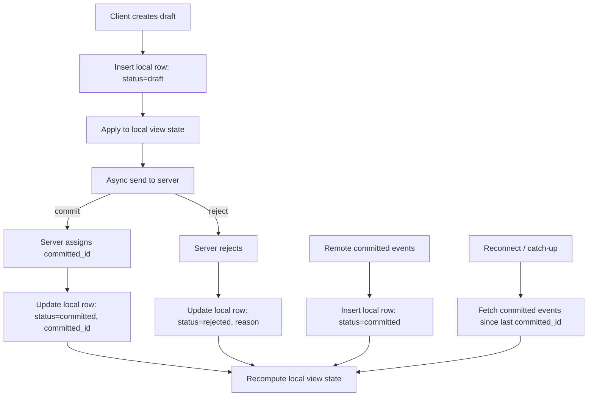

# Drafts

This document defines the client-side draft lifecycle, local view computation, ordering strategy, draft clock, and the full data flow for offline-first event handling.

## Event Lifecycle

### 1) Create Draft (local)

- If running **model mode**, validate the event locally before insert.
- Insert row with `status='draft'`, `committed_id=NULL`, `partitions=[...]`
- Apply to UI immediately (optimistic)
- Enqueue async send to server

### 2) Committed by Server

- Update same row: `status='committed'`, set `committed_id`, `status_updated_at` (server-provided time)
- Draft is removed from overlay automatically (by status)

### 3) Rejected by Server

- Update row: `status='rejected'`, set `status_updated_at` (server-provided time, optionally store reason)
- Draft no longer appears in UI (excluded by status)

### 4) Remote Committed Event (other clients)

- Insert row as `status='committed'`, set `committed_id`, `partitions=[...]`
- `id` is included and matches the origin client's draft id

## Local View Computation

The UI state should be computed from:

1. **Committed events** (all rows with `status='committed'` that include the partition)
   - Ordered by `committed_id` (global incremental id)
2. **Draft events** (all rows with `status='draft'` that include the partition)
   - Ordered by `draft_clock` (tie-break with `id` if needed)

Rejected drafts are **excluded** from view computation.

### Naming

- **Committed state**: state built only from committed events.
- **Local view state** (effective state): committed state + draft overlay.

### Ordering Strategy

- **Do not interleave** drafts into the committed stream.
- Always compute: `committed_state` → then apply all drafts on top.
- When a new committed event arrives (local commit or remote broadcast), **recompute committed state** and re-apply drafts (rebase).
- This may cause brief UI reordering during poor connectivity, but LWW + rebase keeps the client simple and convergent.

## Draft Clock (Lamport-style)

- `draft_clock` is a **monotonic local counter (global, not per partition)**.
- Draft ordering always uses `(draft_clock, id)` even when filtering by partition.
- On each local draft: `draft_clock += 1` and store it on the row.
- On startup: set `draft_clock` to the max value found for the local client (filter by `client_id = local`).
- Remote events do **not** update the local `draft_clock` (drafts are local-only).

Crash-recovery note: `draft_clock` has no cross-client meaning and does not participate in server dedupe. If no draft rows exist at startup, initializing to `0` is safe. The only requirement is local monotonicity for newly created drafts.

## Full Data Flow

### 1) Create Draft (local-first)

- Client generates a UUID `id`.
- Client increments local `draft_clock` and stores it with the draft row.
- If running **model mode**, validate the event locally before insert.
- Insert into local DB as `status='draft'`.
- Apply draft to **local view state** immediately.

### 2) Async Send to Server

- Client enqueues the draft for delivery.
- Transport can be:
  - **WebSocket**: push `submit_event` (or `submit_events` for batch).
  - **Polling**: batch and POST drafts on a schedule.
- Drafts must be submitted in `draft_clock` order. If new drafts are created while the queue is draining, they are appended to the end of the queue and submitted after earlier drafts.

### 3) Server Response (Commit or Reject)

**Committed by server**
- Server assigns `committed_id`.
- Client updates local row: `status='committed'`, set `committed_id`, `status_updated_at`.
- Recompute **local view state**: committed stream → drafts overlay.

**Rejected by server**
- Client updates local row: `status='rejected'`, set `status_updated_at`, optional `reject_reason`.
- Recompute **local view state** (draft removed).

### 4) Remote Committed Events

- Server sends committed events from other clients.
- Client inserts as `status='committed'` with `committed_id` and `partitions=[...]`.
- `id` is included and matches the origin client's draft id.
- Recompute **local view state**.

### 5) Reconnect / Catch-up

- Client requests missed committed events since last `committed_id` (global cursor).
- Apply all new committed events in order.
- Rebase drafts on top (recompute **local view state**).
- After sync completes, retry all pending drafts (status=draft) in `draft_clock` order. The server dedupes by `id`, so retrying already-committed drafts is safe.

### 5a) Out-of-Order Committed Delivery

- Committed events may arrive out of order (polling, reconnect, retries).
- Always compute committed state using `ORDER BY committed_id`, so storage order does not matter.
- If keeping an in-memory incremental state, buffer until gaps fill **or** rebuild committed state from the ordered DB stream.

### 6) Duplicate Sends / Retries

- Retries use the same `id`.
- Server dedupes by `id` and returns the existing `committed_id`.
- Client updates the same local row (idempotent).

### 7) Commit Delivery Idempotency (Upsert Strategy)

When a committed event arrives (local commit response or broadcast), apply it with **update-then-insert** semantics:

1. **UPDATE** by `id` (primary key) to upgrade a local draft into committed.
2. If no row was updated, **INSERT** the committed row.
3. Use `ON CONFLICT(committed_id) DO NOTHING` on the insert to ignore duplicates (retry/broadcast).
4. If the insert fails due to `id` uniqueness, re-run the UPDATE (another path already inserted it).

This avoids double-apply while ensuring drafts are properly upgraded.

Conflict diagnostic: if `ON CONFLICT(committed_id) DO NOTHING` affects 0 rows, check whether the existing row for that `committed_id` has the same `id`. If the ids differ, this is a protocol integrity violation — log it and trigger a full re-sync.
