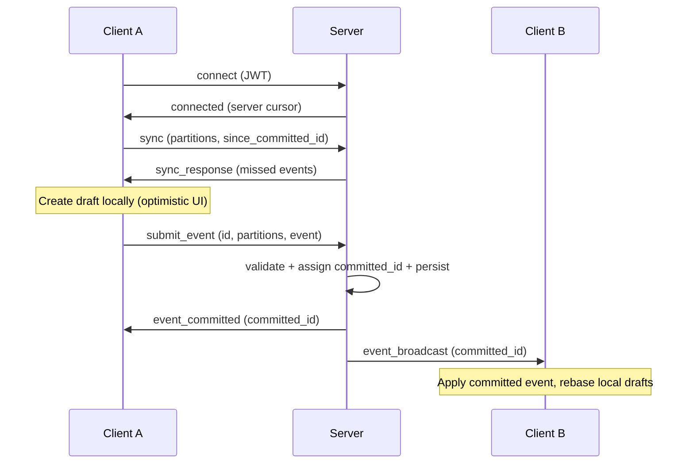

# Insieme Protocol Overview

Insieme is an offline-first collaborative library built on an authoritative server model. Clients create events locally (optimistic UI), send them to the server for validation, and receive committed events back in a globally ordered stream. Conflict resolution uses Last-Write-Wins (LWW) with the server's commit order as the canonical timeline.

For design philosophy, goals, and trade-offs, see [motivation.md](motivation.md).

## Architecture

## Document Map

### Protocol (server-side wire format and semantics)

| Document | Covers |
|----------|--------|
| [protocol/messages.md](protocol/messages.md) | Message envelope, all client/server message schemas |
| [protocol/connection.md](protocol/connection.md) | Handshake, auth (JWT), heartbeat, disconnect, reconnect |
| [protocol/ordering-and-idempotency.md](protocol/ordering-and-idempotency.md) | `committed_id` ordering, dedup by `id`, payload equality |
| [protocol/errors.md](protocol/errors.md) | Error codes, connection effects, recovery guidance |
| [protocol/partitions.md](protocol/partitions.md) | Partition constraints, subscriptions, multi-partition events |
| [protocol/validation.md](protocol/validation.md) | Server validation, tree vs model mode, model versioning |
| [protocol/durability.md](protocol/durability.md) | Server flow, sync/catch-up, persistence, storage, limits |

### Client (local storage and state management)

| Document | Covers |
|----------|--------|
| [client/storage.md](client/storage.md) | Events table, snapshots, indexes, query patterns |
| [client/drafts.md](client/drafts.md) | Draft lifecycle, draft clock, rebase, view computation |
| [client/tree-actions.md](client/tree-actions.md) | Tree data structure, treePush/Delete/Update/Move, edge cases |

### Scenarios

| Document | Covers |
|----------|--------|
| [sync-examples.md](sync-examples.md) | Index of all 19 end-to-end sync scenarios |

### Future Work

| Document | Covers |
|----------|--------|
| [drafts/collaborative-text.md](drafts/collaborative-text.md) | Design draft for native OT-based text editing (not implemented) |

## Glossary

| Term | Definition |
|------|-----------|
| `id` | Globally unique UUID assigned by the client when creating an event. Used for dedup and draft-to-commit matching. |
| `committed_id` | Server-assigned global monotonic integer. Defines the canonical ordering of all committed events. Never reused, survives restarts. |
| `draft_clock` | Local monotonic counter on each client for ordering drafts. Not transmitted to the server; no cross-client meaning. |
| `partitions` | Array of strings identifying logical streams an event belongs to. An event can belong to multiple partitions. |
| `rebase` | Recomputing local view state by replaying committed events in order, then applying drafts on top. Triggered when new committed events arrive. |
| `snapshot` | Serialized committed-only state for a partition. Used for fast initialization without replaying the full event log. |
| `model_version` | Integer version of the model/domain schema (model mode). When it changes, clients must invalidate snapshots and re-sync. |
| `sync cycle` | A sequence of paginated `sync` / `sync_response` exchanges until `has_more=false`. Broadcasts received during a cycle are buffered if they exceed the cycle's high-watermark. |
| `LWW` | Last-Write-Wins. Conflict resolution strategy where the event with the higher `committed_id` wins. The server's commit order is deterministic and final. |
